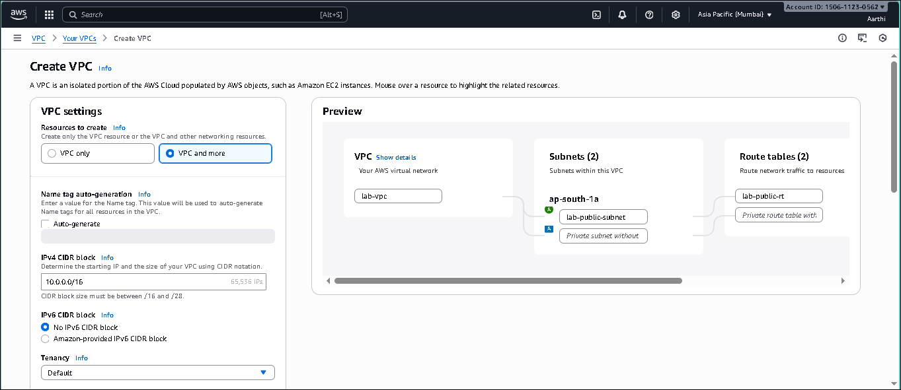

A complete monitoring and alert automation project using Amazon CloudWatch and SNS.
This project demonstrates installing the CloudWatch agent on an EC2 instance, collecting system metrics, creating alarms, and setting up email notifications.

## Overview

This project explains how to monitor an Amazon EC2 instance using CloudWatch Metrics, CloudWatch Agent, SNS, and CloudWatch Alarms.
It covers installing the CloudWatch agent, collecting CPU, memory, and disk metrics, and configuring automated alerts through Amazon SNS.

## Project Highlights

Installed and configured the CloudWatch Agent on an EC2 instance
Collected system metrics including CPU utilization, memory usage, and disk usage
Visualized instance performance through CloudWatch graphs and dashboards
Created an SNS Topic and enabled email subscription for alert notifications
Configured a CloudWatch Alarm to trigger notifications when CPU usage crossed a threshold
Demonstrated real-time monitoring and alerting for cloud infrastructure

## Project Screenshots

| Description | Screenshot |
|------------|------------|
| VPC Created for EC2 Monitoring |  |
| IAM Role for CloudWatch Agent |  |
| EC2 Instance Details |  |
| Apache Web Server Installed |  |
| SSH Connection to EC2 |  |
| Web Page Working on EC2 |  |
| CloudWatch Metrics Visible |  |
| CloudWatch Agent Installed |  |
| CloudWatch Agent Started |  |
| CloudWatch Agent Status Check |  |
| CloudWatch Alarm Created |  |
| SNS Subscription Confirmed |  |
| SNS Topic Created |  |

## Tools & AWS Services Used

Amazon EC2 – Linux instance for hosting the CloudWatch Agent
Amazon CloudWatch – Metrics, dashboards, and alarms
CloudWatch Agent – Collected memory, disk, and detailed system metrics
Amazon SNS (Simple Notification Service) – Email alert notifications
IAM (Identity & Access Management) – Role for CloudWatch and SNS access
VPC, Subnets, Security Groups – Networking & access control

## Skills Gained

Infrastructure monitoring
CloudWatch metrics collection and visualization
Creating alarms for incident detection
SNS-based alert automation
IAM role creation and permissions management
Linux system administration basics
Debugging CloudWatch Agent and EC2 configurations
Real-world cloud incident response workflow

## 💚 Author
Aarthi Arivuselvan
AWS Cloud Enthusiast ☁️ | Linux Learner 🐧
📧 Contact: aarthi11920@gmail.com
